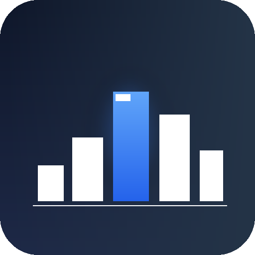
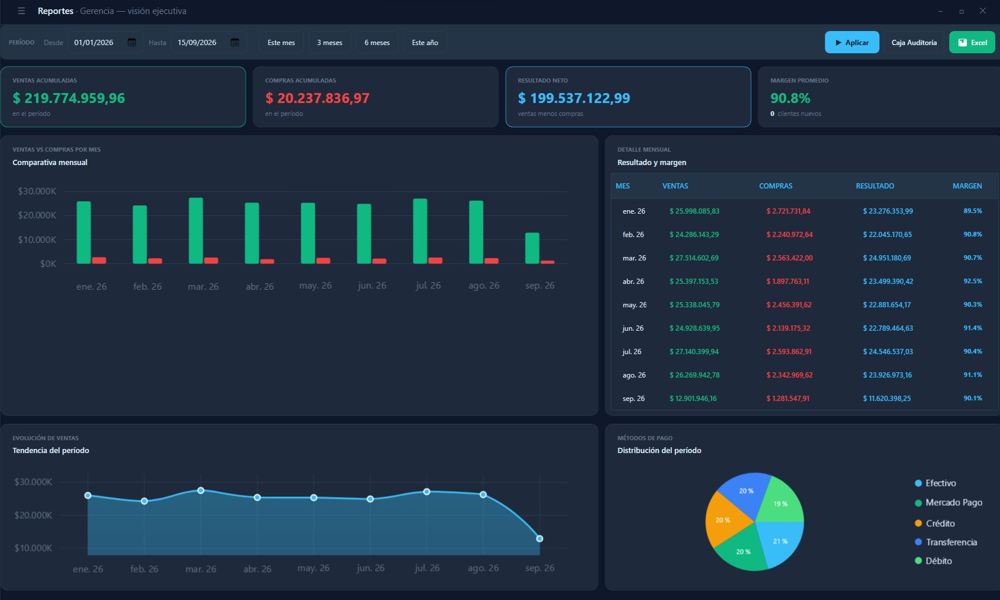
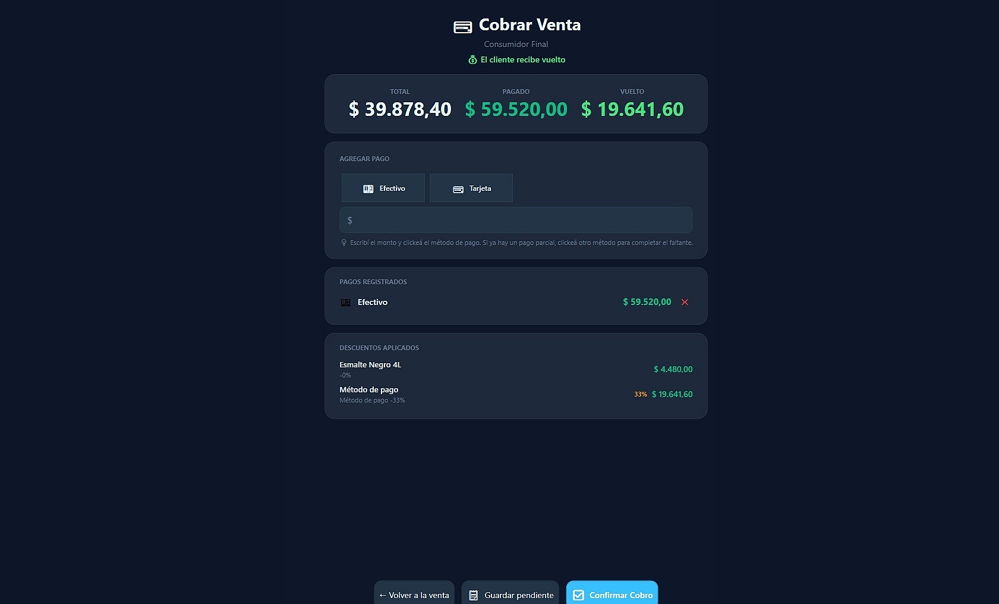
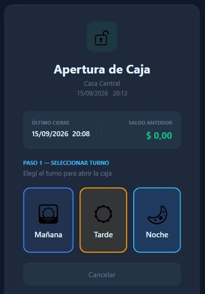
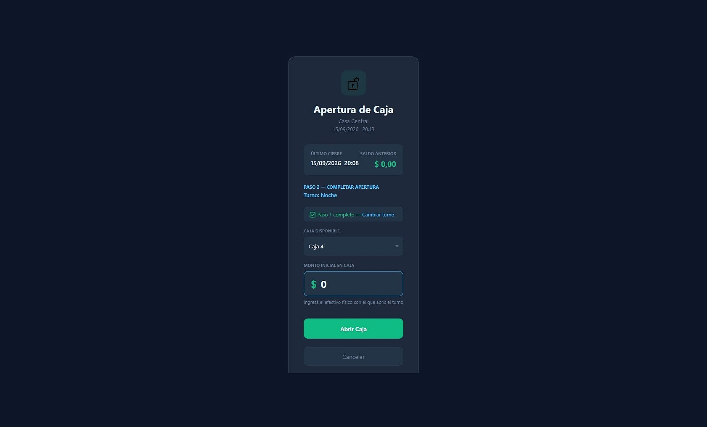
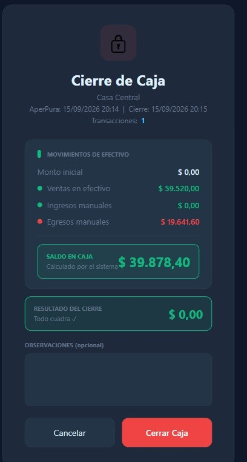
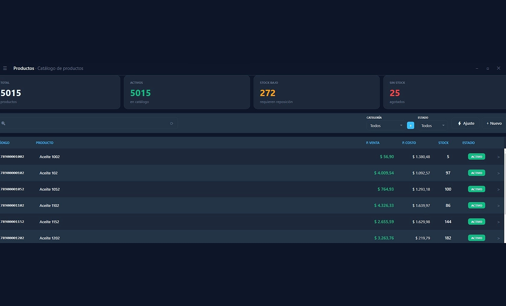
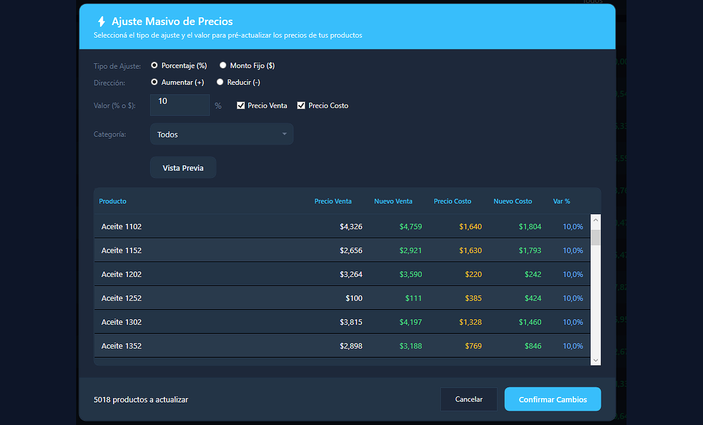
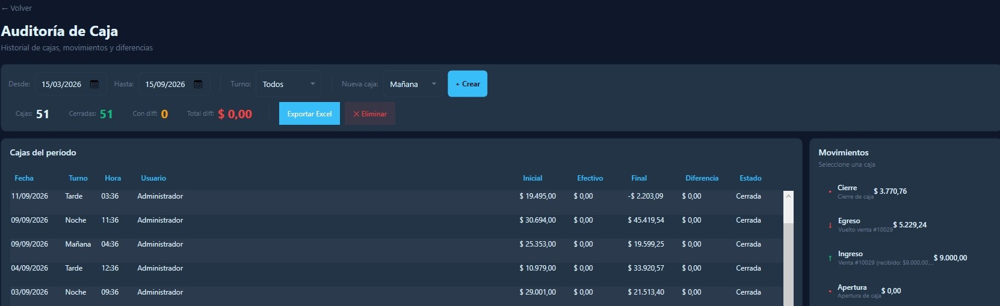

  

# GestionComercial POS

**Sistema de Punto de Venta (POS) Windows**

GestionComercial es un software de gestión comercial diseñado para pequeños y medianos comercios: ventas, compras, productos, stock, caja, clientes y reportes en una sola aplicación de escritorio rápida y confiable, con respaldo automático de datos.

---

##  Capturas

| | |
|---|---|
|  *Reporte gerencial* |  *Cobro de venta* |
|  *Apertura de caja* |  *Apertura de caja 2* |
|  *Cierre de caja* |  *Listado de productos* |
|  *Ajuste masivo de precios* |  *Auditoría de caja* |

---

##  Funcionalidades Version Completa

| Módulo | Funciones clave |
|--------|----------------|
| **Ventas** | Nueva venta con búsqueda de productos, cobro dividido en múltiples métodos de pago (efectivo, tarjeta, transferencia), descuentos por ítem, historial con detalle, anulación con motivo y comprobante |
| **Caja** | Apertura y cierre con saldo inicial/final, control de turnos, movimientos de ingresos y egresos, auditoría con indicadores |
| **Productos** | CRUD completo, categorías, código de barras, stock mínimo configurable (hasta 100 productos en demo) |
| **Clientes** | CRUD completo con historial de ventas asociado |
| **Reporte diario** | Reporte diario de ventas del día |
| **Compras** | Registro de compras con selección de proveedor, ingreso de mercadería con precio de costo, subtotales automáticos e historial |
| **Proveedores** | CRUD completo con historial de compras asociado |
| **Inventario** | Stock por producto con movimientos (entrada/salida/ajuste), filtros por tipo y fecha, vista de stock crítico y paginación |
| **Reportes completos** | Dashboard ejecutivo con gráficos de torta y barras (ventas diarias/semanales), stock crítico y exportación a Excel |
| **Descuentos** | Configuración de descuentos globales y por categoría, combinables con método de pago |
| **Usuarios y roles** | Autenticación por email con contraseña encriptada (BCrypt), tres roles (Gerente / Administrador / Vendedor) con permisos granulares por módulo, sesión por empresa |
| **Configuración** | Datos de la empresa, sucursales, métodos de pago, gestión de usuarios y roles, perfil de usuario y cambio de contraseña |
| **Mantenimiento** | Herramienta de diagnóstico y mantenimiento del sistema (visible solo para Dev) |
| **Ajuste masivo de precios** | Actualización de precios de varios productos a la vez |
| **Importación desde Excel** | Carga masiva de productos desde una planilla |

---

##  Tecnología y arquitectura

| Componente | Tecnología |
|------------|------------|
| Lenguaje | C# |
| Framework | .NET 8 |
| Interfaz de usuario | WPF (Windows) |
| ORM | Entity Framework Core 8 |
| Base de datos | SQLite |
| Aplicación | Escritorio autocontenida (Windows 10/11 x64) |

**Arquitectura:** el sistema sigue una **arquitectura limpia (Clean Architecture)** con capas separadas por responsabilidad y dependencias estrictas hacia adentro: presentación (UI), casos de uso (Aplicación), dominio y persistencia. Esto mantiene las reglas de negocio independientes de la tecnología de datos y de la interfaz, facilitando el mantenimiento y la evolución.

**Patrones de diseño utilizados:**

| Patrón | Uso |
|--------|-----|
| **MVVM** | Separación de interfaz (Vista), estado y lógica (ViewModel) y modelo de datos |
| **Repository** | Acceso a datos encapsulado detrás de interfaces, independiente del ORM |
| **Unit of Work** | Transacciones consistentes entre múltiples operaciones |
| **Strategy** | Procesamiento de pagos por método (efectivo, tarjeta, transferencia, otros) |
| **Inyección de dependencias** | Composición y testeo de componentes desacoplados |
| **Command (RelayCommand)** | Manejo de acciones de la interfaz sin acoplar la Vista al ViewModel |

Todo el código sigue **principios SOLID** y cuenta con una **suite de pruebas automatizadas** (572 tests) que cubre la lógica de negocio, la persistencia y los ViewModels.

---

##  Versión demo

La versión demo permite probar el sistema con las funcionalidades:

- **Ventas** completas (POS con cobro dividido y comprobante).
- **Caja** (apertura, cierre y movimientos).
- **Productos** (hasta **100 productos**).
- **Clientes** (básico).
- **Reporte diario** de ventas.
- Período de prueba: **20 días** desde la primera ejecución.
- Límite de **200 ventas** durante la prueba.

##  Instalación

> El instalador de la **versión demo** está disponible en **Releases**.

Requisitos:
- Windows 10 u 11 (64 bits)
- El instalador de la demo es **autocontenido** (incluye el runtime de .NET 8) — no requiere instalaciones adicionales.

---

##  Comenzar

1. Instalá el programa desde **Releases**.
2. Iniciá sesión con los usuarios demo que se generan en la primera ejecución.
3. Credenciales:
   - **Admin:** admin@miempresa.com — Contraseña: Admin123!
   - **Vendedor:** vendedor@miempresa.com — Contraseña: Vendedor123!
---

##  Privacidad

- Los datos se guardan **localmente** en la base de datos SQLite del equipo (no se envían a servidores externos).
- La aplicación no recopila ni transmite información personal.

---

© 2026 Axel Silva — Todos los derechos reservados.
